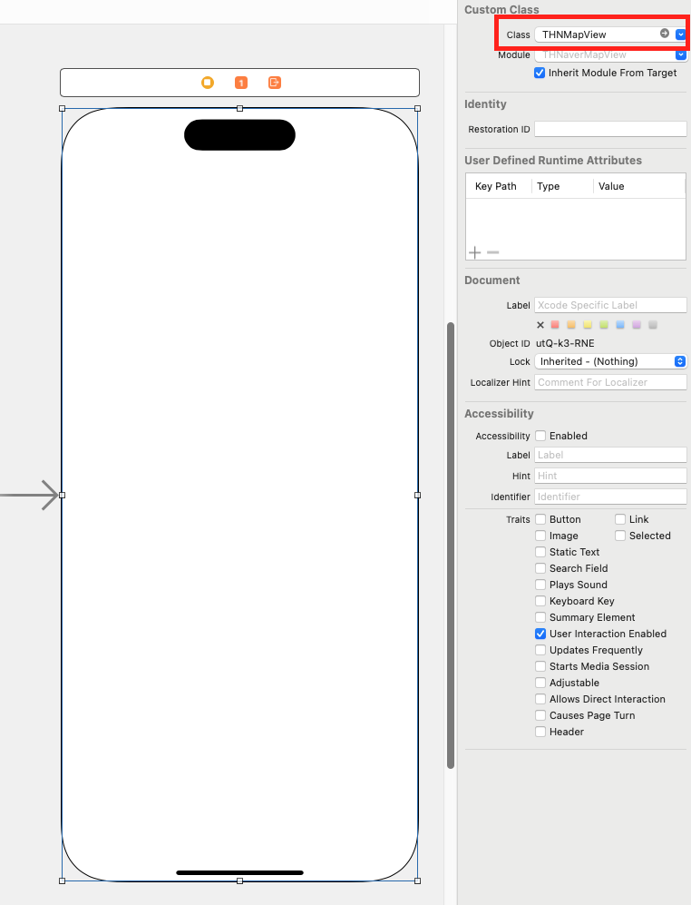

# THNaverMapView
#### Super Easy Naver Map using NMapsMap Wrapping

# Feature
- [x] pure swift 5.0 code

# Installation

#### CocoaPods
Simply add THNaverMapView to your `Podfile`.

```
pod 'THNaverMapView'
```
Enter command instruction into your terminal.

```
pod install
```

# Usage

You must create UIView and it use custom class in the storyboard after install THNMapView.

Then you must also import THNaverMapView, CoreLocation and create a IBOutlet.



And write configure and make delegate methods with THSegmentControlDelegate, THPageControlDelegate.

```swift
import UIKit
import CoreLocation
import THNaverMapView

class ViewController: UIViewController {
    
    @IBOutlet weak var mapView: THNMapView!
    
    let dto: [THNMapDto] = []
    let location = CLLocationCoordinate2D(latitude: 37.5051654, longitude: 127.0625883)
    
    override func viewDidLoad() {
        super.viewDidLoad()
        
        mapView.setup(self,
                      location: location,
                      icon: UIImage(named: "mapIcon")!)
        mapView.reload(dto)
    }
}

extension ViewController: THNMapViewDelegate {
    func thNMapViewErrorState(_ error: Error) {
        print("error:::::", error)
    }
    
    func thNMapViewDidTap(_ data: THNMapDto) {
        print("\(data.index), \(data.name ?? "-")\nlatitude:\(data.location.latitude), longitude:\(data.location.longitude)")
    }
}
```

# License

THNaverMapView is available under the MIT license. See the LICENSE file for more info.